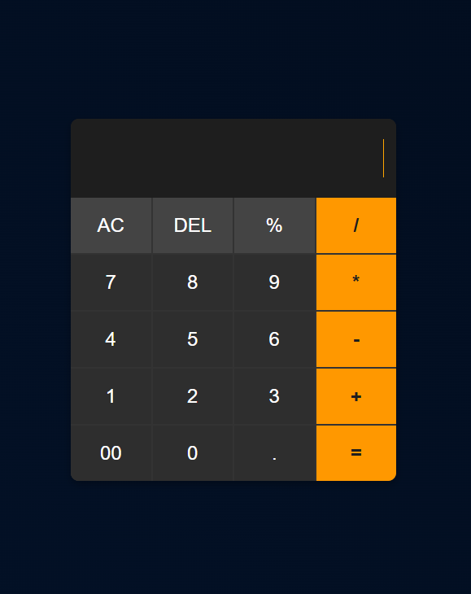

# Simple JavaScript Calculator

This is a sleek, modern calculator web application built with HTML, CSS, and JavaScript. It features a responsive, dark-mode theme and provides all the essential functions for basic arithmetic operations.

## 📸 Preview



## ✨ Features

  * **Basic Arithmetic:** Perform addition (`+`), subtraction (`-`), multiplication (`*`), and division (`/`).
  * **Clear Functions:**
      * **AC (All Clear):** Resets the entire calculation.
      * **DEL (Delete):** Acts as a backspace, removing the last entered character.
  * **Additional Operators:** Includes support for decimal numbers (`.`), double zero (`00`), and percentage (`%`).
  * **Responsive UI:** A clean, dark-mode interface built with CSS Grid that looks great on all screen sizes.
  * **Interactive Feedback:** Buttons have a smooth hover transition for a better user experience.

## 💻 Technologies Used

  * **HTML5:** For the basic structure and content of the calculator.
  * **CSS3:** For all styling, including the dark theme, button layout (CSS Grid), and hover effects.
  * **JavaScript (ES6+):** For all the client-side logic, including DOM manipulation and calculation functions.

## 🚀 How to Run

No complex setup is required\!

1.  **Download the files:**
      * `index.html`
      * `styles.css`
      * `script.js`
2.  **Place them in the same folder:** Ensure all three files are in the same directory.
3.  **Open the `index.html` file:** Simply double-click the `index.html` file to open it in your default web browser (like Chrome, Firefox, or Edge).

## 🧠 Core Logic

The calculator's functionality is driven by four key JavaScript functions:

  * `appendValue(value)`: Appends the clicked number or operator to the display.
  * `clearDisplay()`: Empties the display input field.
  * `deleteValue()`: Slices the last character off the display string, acting as a backspace.
  * `calculate()`: Uses the built-in `eval()` function to compute the final result of the expression in the display.

<!-- end list -->

```javascript
// Located in script.js

let display = document.getElementById('display');

function appendValue(value){
    display.value += value;
}

function clearDisplay(){
    display.value = "";
}

function deleteValue(){
    display.value = display.value.toString().slice(0,-1);
}

function calculate(){
    display.value = eval(display.value);
}
```

> **Note:** This project uses `eval()` for simplicity. In a real-world, production environment, it's generally safer to use a custom parsing function or a dedicated math library to evaluate the expression and prevent potential security risks.

## 📄 License

This project is open-source and available under the MIT License.
